#  ScholarSync

> An AI-powered, full-stack study platform that transforms your documents into **quizzes**, **flashcards**, and an **interactive RAG-powered notebook** — all backed by a free-tier cloud AI stack.

[](https://nodejs.org/)
[](https://react.dev/)
[](https://www.mongodb.com/atlas)
[](https://groq.com/)
[](LICENSE)


## 1. High-Level Overview

ScholarSync is a **MERN-stack** (MongoDB, Express, React, Node.js) application that uses **Retrieval-Augmented Generation (RAG)** to help students study smarter. Upload any document and the system extracts text, generates vector embeddings, and lets you quiz yourself, create flashcards, and chat with an AI tutor — all grounded in your own uploaded content.

| Feature | Description |
|---|---|
| 📄 **Document Upload** | PDF, DOCX, TXT, Markdown, PNG/JPG/WEBP — up to 15 MB |
| 🤖 **AI Quiz Generation** | 5 MCQs (Easy / Medium / Hard) generated from document chunks via Groq |
| 📝 **Quiz Attempt Tracking** | Scored answers, per-question explanations, pass/fail at 70% |
| 🃏 **AI Flashcard Generation** | 10 high-yield flashcard pairs generated from document content |
| 🔁 **Spaced Repetition** | Leitner 5-box system — Easy / Medium / Hard → review intervals |
| 💬 **Notebook RAG Chat** | Context-aware Q&A grounded in the uploaded document |
| 📊 **Analytics Dashboard** | Daily scores, subject breakdown, study streaks, recharts visualizations |
| 🔐 **Auth** | JWT email/password + Google OAuth (one-click) |
| 🌙 **Dark UI** | Rich dark theme, Tailwind CSS + Framer Motion animations |

---

## 2. Tech Stack

### Frontend

| Layer | Technology |
|---|---|
| Framework | React 18 + Vite 5 |
| Routing | React Router v6 (protected + public routes) |
| Styling | Tailwind CSS v3 + Framer Motion |
| Auth Client | JWT via httpOnly cookie (managed by backend) |
| HTTP Client | Axios v1 (with request interceptors) |
| Charts | Recharts v2 |
| Notifications | react-hot-toast |

### Backend

| Layer | Technology |
|---|---|
| Runtime | Node.js ≥ 18 (ESM) |
| Framework | Express.js v4 |
| Database | MongoDB Atlas (via Mongoose v8) |
| Auth Server | JWT (jsonwebtoken) + bcryptjs |
| AI Integration | Groq SDK (LLaMA 3.3-70B Versatile) |
| Embeddings | HuggingFace Inference API (all-MiniLM-L6-v2) |
| File Upload | Multer (memory storage, max 15 MB) |
| Security | Helmet, CORS, express-rate-limit |
| Logging | Morgan (dev only) |

### AI & Cloud Services

| Service | Model | Use Case | Cost |
|---|---|---|---|
| **Groq Cloud** | `llama-3.3-70b-versatile` | Quiz, Flashcard, Notebook chat | Free tier |
| **HuggingFace** | `sentence-transformers/all-MiniLM-L6-v2` | 384-dim text embeddings | Free tier |
| **MongoDB Atlas** | Atlas Search + Atlas Vector Search | Full-text + semantic retrieval | Free M0 |
| **Google OAuth** | Google Identity (via google-auth-library) | One-click Google login | Free |

---

## 3. System Architecture Diagram

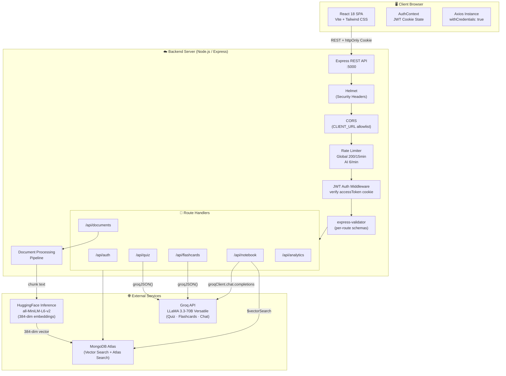

---

## 4. Frontend Architecture

### Page Routing

Navigation is handled by **React Router v6** with two route guards — `ProtectedRoute` (redirects to `/login` if unauthenticated) and `PublicRoute` (redirects to `/dashboard` if already logged in).

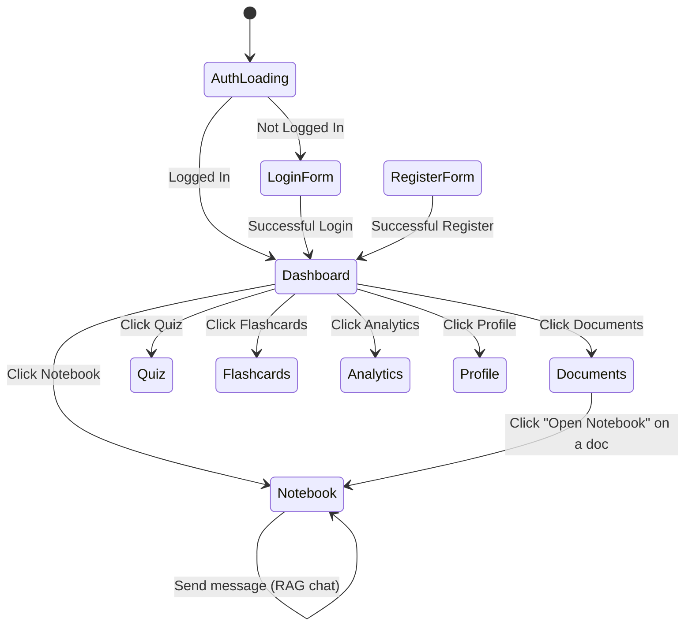

### Frontend Directory Structure

```
frontend/src/
├── main.jsx                        # React DOM entry point
├── App.jsx                         # BrowserRouter + route definitions
├── index.css                       # Base reset styles
├── api/                            # Axios instance + per-module helpers
├── context/
│   └── AuthContext.jsx             # Global auth state (useContext + useReducer)
├── hooks/                          # Custom React hooks (useDocuments, useQuiz …)
├── utils/                          # Frontend helpers (formatDate, truncate, etc.)
├── components/
│   ├── auth/
│   │   ├── LoginForm.jsx           # Email/password + Google OAuth login
│   │   ├── RegisterForm.jsx        # Email/password registration
│   │   ├── ProtectedRoute.jsx      # Auth guard (+ PublicRoute)
│   │   └── GoogleCallback.jsx      # Google OAuth callback handler
│   ├── layout/
│   │   └── AppLayout.jsx           # Sidebar + Outlet shell
│   ├── documents/                  # Document upload, list, delete components
│   ├── flashcards/                 # Deck grid, review session UI
│   ├── quiz/                       # Quiz UI, attempt review breakdown
│   ├── analytics/                  # Recharts wrappers (line, bar, pie)
│   └── ui/                         # Shared primitives (Button, Modal, Spinner)
└── pages/
    ├── DashboardPage.jsx           # Stats overview + quick actions
    ├── DocumentsPage.jsx           # Upload + manage documents
    ├── NotebookPage.jsx            # RAG chat interface (/notebook/:docId)
    ├── QuizPage.jsx                # Generate + take quizzes
    ├── FlashcardsPage.jsx          # Deck list + spaced-repetition review
    ├── AnalyticsPage.jsx           # Performance charts & subject breakdown
    └── ProfilePage.jsx             # User profile + study goal setting
```

### Key Frontend Patterns

| Pattern | Description |
|---|---|
| **httpOnly Cookie Auth** | `axios` is configured with `withCredentials: true`; no token stored in JS — immune to XSS |
| **AuthContext** | Global user state; `getMe()` called on mount; logout clears state + cookie |
| **Protected Routes** | `ProtectedRoute` redirects unauthenticated users; `PublicRoute` redirects authenticated users away from `/login` |
| **Optimistic UI** | Quiz like/save, flashcard review update locally before server confirms |
| **Framer Motion** | Page-level fade/slide transitions + micro-animations on cards and modals |
| **Dark Mode** | Tailwind `dark:` classes; `class="dark"` toggled on `<html>` and persisted to `localStorage` |

---

## 5. Backend Architecture

### Server Entry Point (`server.js`)

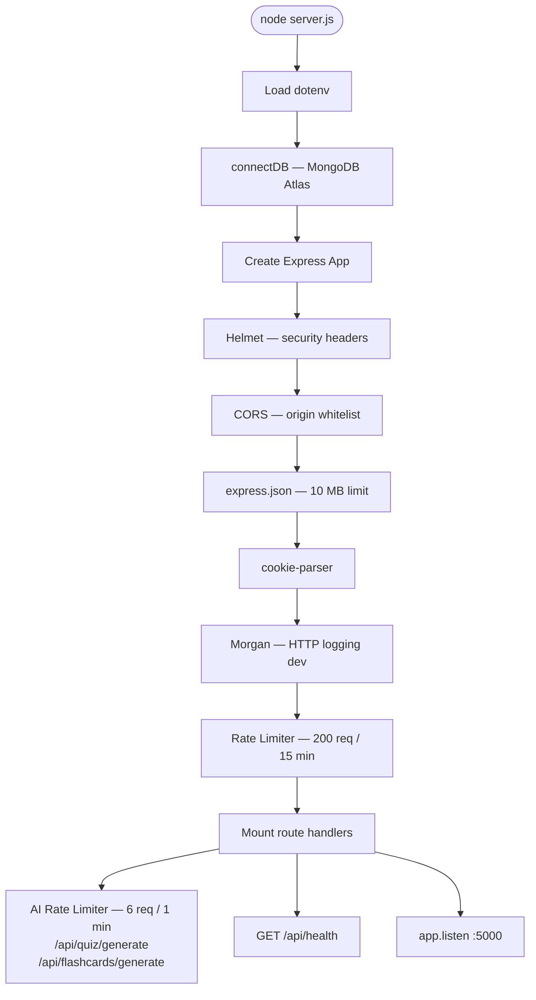

### Middleware Pipeline

```
Request
  │
  ▼
Helmet()          — sets 11+ security response headers
  │
  ▼
CORS()            — allows CLIENT_URL with credentials
  │
  ▼
express.json()    — parses body up to 10 MB
  │
  ▼
cookie-parser()   — parses httpOnly cookies
  │
  ▼
morgan("dev")     — logs method, URL, status, response time
  │
  ▼
globalLimiter     — 200 req per 15 min per IP
  │
  ▼
Route Handler
  │
  ▼
authenticate()    — reads accessToken cookie → jwt.verify()   ← Applied per-route
  │
  ▼
validate()        — collects express-validator errors → 422    ← Applied per-route
  │
  ▼
Controller Business Logic → MongoDB / Groq / HuggingFace
  │
  ▼
Response JSON
```

---

## 6. Data Models (MongoDB Schemas)

### Entity-Relationship Diagram

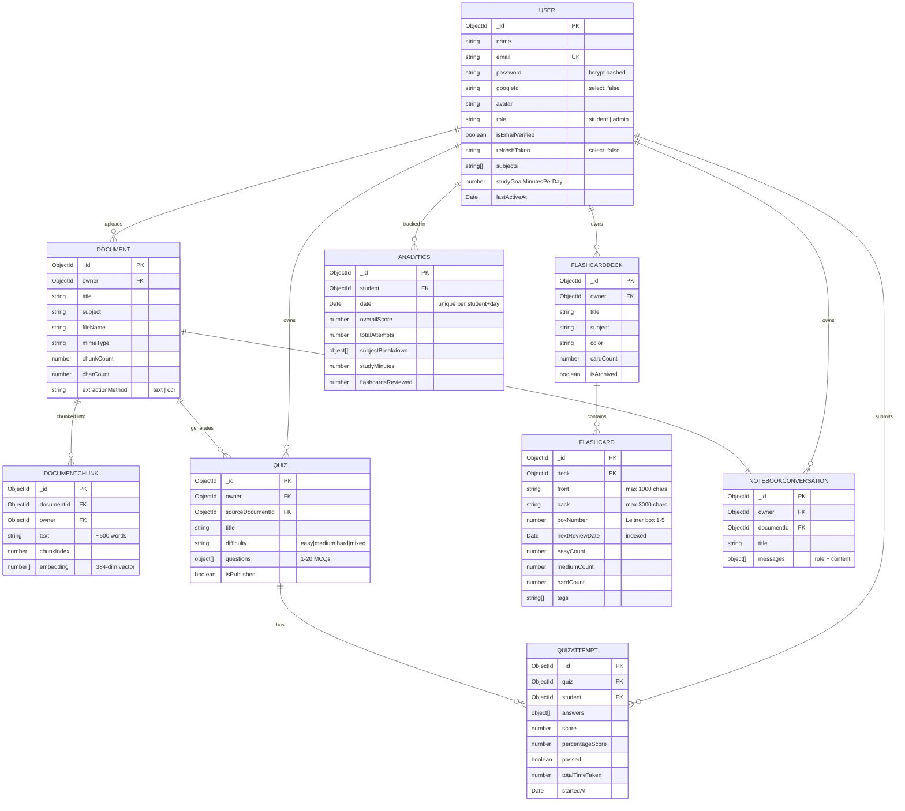

### MongoDB Indexes

| Collection | Index | Purpose |
|---|---|---|
| `users` | `email` (unique) | Fast login lookup |
| `documents` | `{ owner, createdAt: -1 }` | User's docs newest first |
| `documentchunks` | `{ documentId, chunkIndex }` | Sequential chunk retrieval |
| `documentchunks` | **Vector Index** `embedding` (384d cosine) | Atlas $vectorSearch |
| `documentchunks` | **Atlas Search** `default` on `text` | $search full-text fallback |
| `quizzes` | `{ owner, createdAt: -1 }` | User's quiz list |
| `quizattempts` | `{ student, submittedAt: -1 }` | Attempt history |
| `quizattempts` | `{ student, subject, submittedAt: -1 }` | Per-subject analytics |
| `flashcards` | `{ deck, nextReviewDate }` | Due card queries |
| `flashcards` | `{ deck, boxNumber }` | Leitner box grouping |
| `analytics` | `{ student, date }` (unique) | One record per student per day |
| `notebookconversations` | `{ owner, documentId }` (unique) | One chat per doc |

---

## 7. API Reference

### Auth — `/api/auth`

| Method | Endpoint | Auth | Description |
|---|---|---|---|
| `POST` | `/register` | ❌ | Register with email & password |
| `POST` | `/login` | ❌ | Login, sets httpOnly JWT cookies |
| `POST` | `/google` | ❌ | Google OAuth (ID token verify) |
| `POST` | `/refresh` | ❌ | Rotate access token via refresh cookie |
| `POST` | `/logout` | ✅ | Clear both auth cookies |
| `GET` | `/me` | ✅ | Get current user profile |
| `PATCH` | `/me` | ✅ | Update name, avatar, subjects, study goal |
| `PATCH` | `/change-password` | ✅ | Change password (current + new) |

### Documents — `/api/documents`

| Method | Endpoint | Auth | Description |
|---|---|---|---|
| `POST` | `/upload` | ✅ | Upload file (`multipart/form-data`) → extract, chunk, embed |
| `GET` | `/` | ✅ | List all user documents |
| `DELETE` | `/:docId` | ✅ | Delete document + chunks + notebook conversation |

### Quiz — `/api/quiz`

| Method | Endpoint | Auth | Description |
|---|---|---|---|
| `POST` | `/generate` | ✅ | AI-generate 5 MCQs from document (rate-limited) |
| `GET` | `/` | ✅ | List all user's quizzes |
| `GET` | `/:quizId` | ✅ | Get single quiz (answers hidden) |
| `POST` | `/:quizId/attempt` | ✅ | Submit attempt → score + trigger analytics |

### Flashcards — `/api/flashcards`

| Method | Endpoint | Auth | Description |
|---|---|---|---|
| `POST` | `/generate` | ✅ | AI-generate 10 flashcards from doc or raw text (rate-limited) |
| `GET` | `/decks` | ✅ | List all decks with due-card counts |
| `GET` | `/decks/:deckId` | ✅ | Get deck + all cards |
| `GET` | `/due` | ✅ | Get cards due today (Leitner filter) |
| `POST` | `/:id/review` | ✅ | Rate card Easy / Medium / Hard → update box + next review |

### Notebook — `/api/notebook`

| Method | Endpoint | Auth | Description |
|---|---|---|---|
| `GET` | `/:docId` | ✅ | Get or auto-create conversation for document |
| `POST` | `/:docId/chat` | ✅ | Send message → RAG retrieval → Groq reply |
| `DELETE` | `/:convId` | ✅ | Clear conversation history (keep shell) |

### Analytics — `/api/analytics`

| Method | Endpoint | Auth | Description |
|---|---|---|---|
| `GET` | `/` | ✅ | Fetch user's daily analytics history |

---

## 8. RAG Pipeline Design

The **Notebook** feature uses a full Retrieval-Augmented Generation pipeline with three retrieval tiers and graceful fallback:

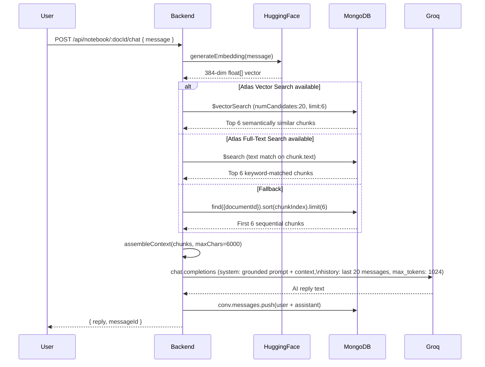

### Retrieval Tier Priority

| Tier | Method | When Used |
|---|---|---|
| **1 — Vector Search** | MongoDB `$vectorSearch` (cosine, 384-dim) | Always attempted first |
| **2 — Full-Text Search** | MongoDB `$search` (Atlas Search index) | Vector search unavailable or returns 0 results |
| **3 — Sequential Chunks** | `find({ documentId }).sort(chunkIndex).limit(6)` | Both search indexes unavailable |

### Context Assembly

```
chunks → [Chunk 1]:\n<text>\n\n[Chunk 2]:\n<text>…
maxChars = 6,000 characters
If chunks empty → "No relevant context found."
```

---

## 9. Document Processing Pipeline

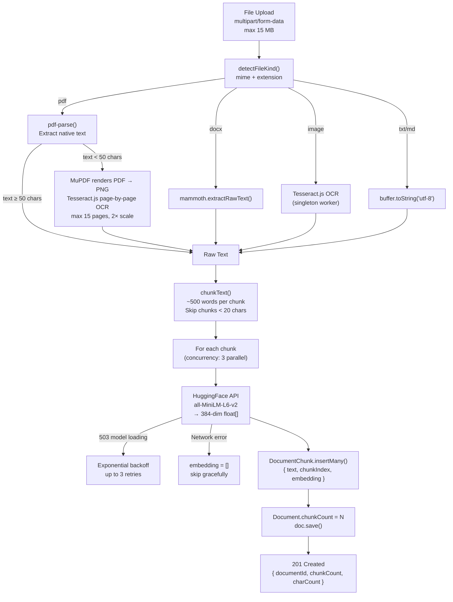

### Supported File Types

| Format | Parser | OCR Fallback |
|---|---|---|
| `.pdf` | `pdf-parse` | MuPDF → Tesseract.js (if < 50 chars extracted) |
| `.docx` | `mammoth` | ❌ |
| `.png / .jpg / .webp` | Tesseract.js directly | — |
| `.txt / .md` | `Buffer.toString('utf-8')` | ❌ |

---

## 10. Authentication Flow

### Email / Password

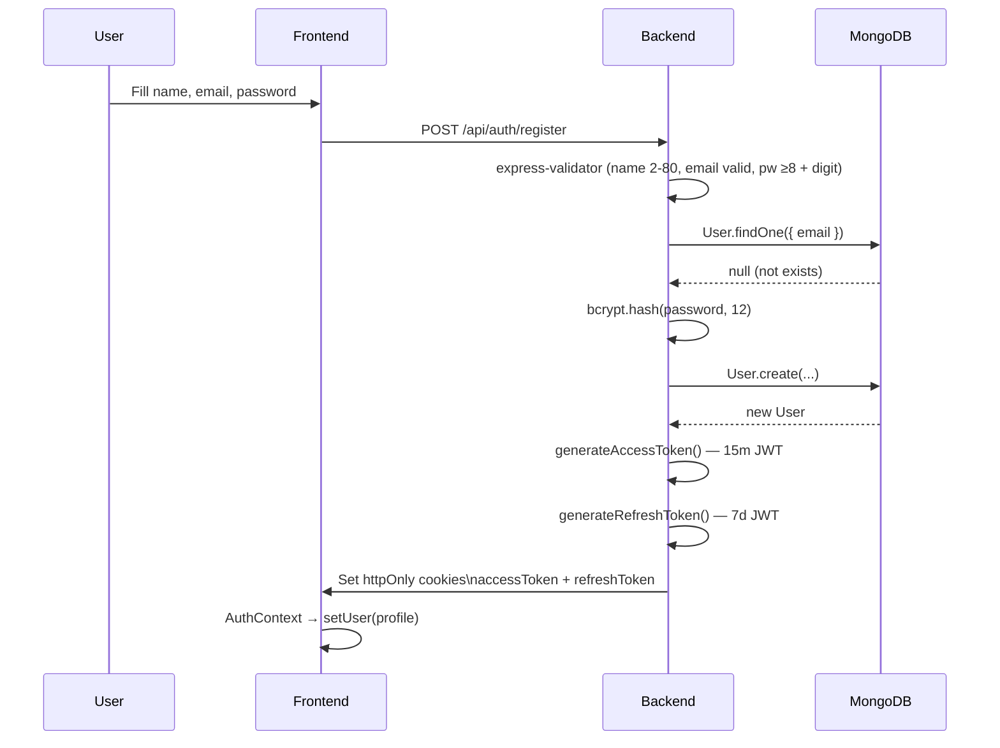

### Google OAuth

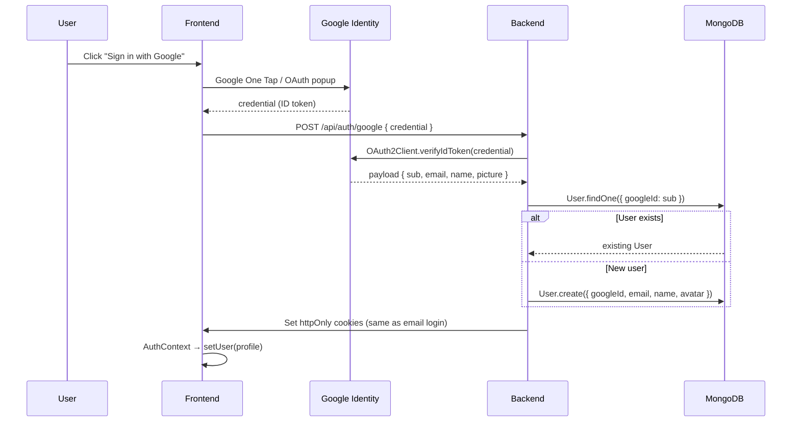

### Token Refresh

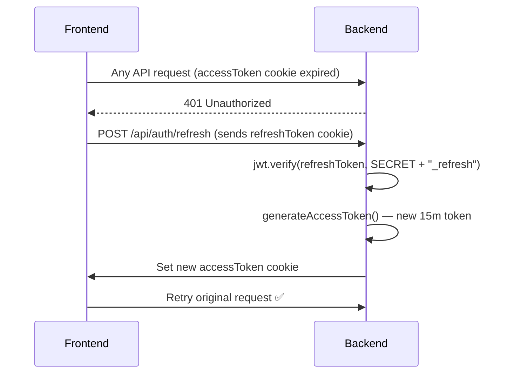

---

## 11. Leitner Spaced-Repetition System

Flashcards use the classic **5-box Leitner system** to schedule reviews based on how well the student knows each card:

```
Rating    │  Box Movement      │  Next Review Interval
──────────┼────────────────────┼───────────────────────
Easy      │  box + 1 (max 5)   │  box 2 → 2 days
          │                    │  box 3 → 4 days
          │                    │  box 4 → 8 days
          │                    │  box 5 → 16 days
Medium    │  stay in box       │  same as current box
Hard      │  reset to box 1    │  1 day
```

### Mastery Score (Virtual Field)

```js
masteryScore = Math.round(
  ((easyCount + mediumCount × 0.5) / (easyCount + mediumCount + hardCount)) × 100
)
```

### Due Card Query

```
GET /api/flashcards/due

MongoDB query:
  Flashcard.find({
    deck: { $in: userDeckIds },
    nextReviewDate: { $lte: new Date() }
  })
  .sort({ boxNumber: 1, nextReviewDate: 1 })
```

Cards are sorted by `boxNumber ASC` — lower boxes (harder, newer) are reviewed first.

---

## 12. Feed Ranking Algorithm

The **Dashboard** shows a personalized feed of the user's own study analytics and upcoming due cards. The **due-card prioritization** uses a composite sort:

### Due Card Priority Formula

```
Priority = boxNumber ASC, nextReviewDate ASC
```

Lower `boxNumber` (box 1 = hardest, least known) cards surface first, then by earliest due date — ensuring the student always sees the cards they know least first.

### Analytics Aggregation

The `Analytics.recordAttempt()` static method uses an **upsert** pattern:

```js
// One document per student per calendar day (unique index on { student, date })
findOneAndUpdate(
  { student: studentId, date: today },
  {
    $inc: { totalAttempts: 1, totalCorrect: correct, totalQuestions },
    $setOnInsert: { student: studentId, date: today }
  },
  { upsert: true, new: true }
)
```

Then manually updates `overallScore` and `subjectBreakdown` (rolling average per subject) before calling `doc.save()`.

---


## 13. Rate Limiting & Security

| Layer | Limit | Window |
|---|---|---|
| **Global** | 200 requests | 15 minutes per IP |
| **AI endpoints** (`/quiz/generate`, `/flashcards/generate`) | 6 requests | 1 minute per IP |
| **File upload** | 15 MB max | per request |
| **Request body** | 10 MB max | per request |
| **Access Token** | 15 minute expiry | httpOnly cookie |
| **Refresh Token** | 7 day expiry | httpOnly cookie |

### Security Headers (Helmet)

| Header | Value |
|---|---|
| `Content-Security-Policy` | Strict policy |
| `X-Content-Type-Options` | `nosniff` |
| `X-Frame-Options` | `DENY` |
| `Strict-Transport-Security` | `max-age=15552000` |
| `X-DNS-Prefetch-Control` | `off` |

### Cookie Security

| Flag | Dev | Production |
|---|---|---|
| `httpOnly` | ✅ | ✅ |
| `secure` | ❌ | ✅ (HTTPS only) |
| `sameSite` | `lax` | `strict` |
| `path` | `/` | `/` |

---

## 14. Data Flow Diagrams

### Uploading a Document

```mermaid
sequenceDiagram
    participant User
    participant Frontend
    participant Backend
    participant HF as HuggingFace
    participant MongoDB

    User->>Frontend: Select file + title + subject
    Frontend->>Backend: POST /api/documents/upload (multipart, max 15MB)
    Backend->>Backend: detectFileKind(mime, filename)
    Backend->>Backend: extractText() — pdf-parse / mammoth / Tesseract OCR
    Backend->>MongoDB: Document.create({ owner, title, subject, fileName })
    Backend->>Backend: chunkText() — split into ~500 word chunks

    loop For each batch of 3 chunks (concurrency=3)
        Backend->>HF: generateEmbedding(chunk text)
        HF-->>Backend: 384-dim float[]
    end

    Backend->>MongoDB: DocumentChunk.insertMany(chunks + embeddings)
    Backend->>MongoDB: doc.chunkCount = N; doc.save()
    Backend-->>Frontend: 201 { documentId, chunkCount, charCount, extractionMethod }
    Frontend->>Frontend: Append doc to list; show success toast
```

### Generating a Quiz

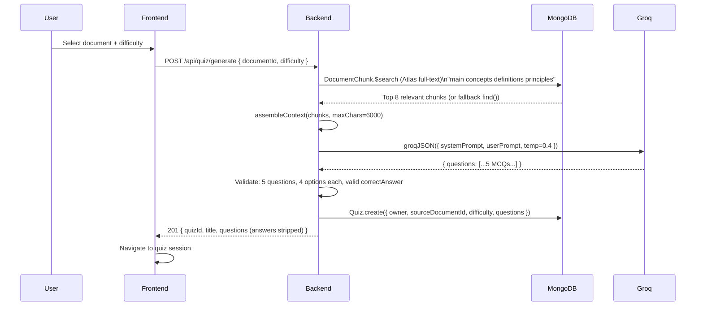

### Submitting a Quiz Attempt

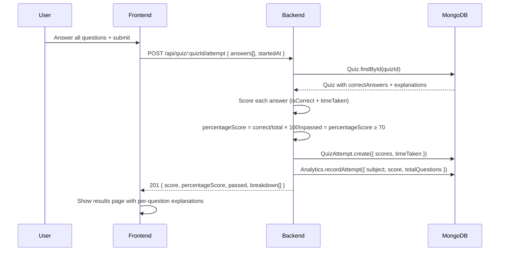

### Notebook RAG Chat

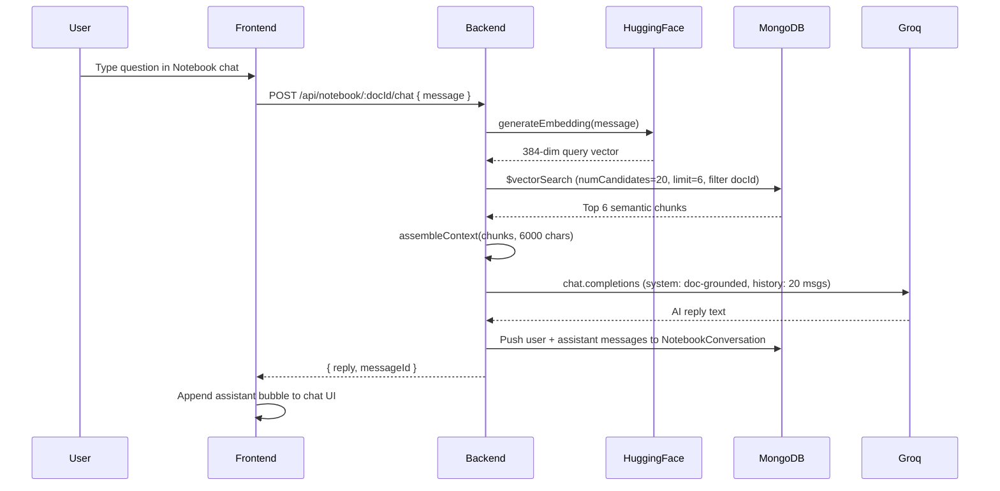

---

## 15. Component Tree

```
App (BrowserRouter + AuthProvider)
├── PublicRoute
│   ├── /login   → LoginForm
│   │   ├── Email/Password fields
│   │   └── Google OAuth button
│   └── /register → RegisterForm
│
└── ProtectedRoute → AppLayout (Sidebar + Outlet)
    ├── Sidebar
    │   ├── NavItems (Dashboard, Documents, Notebook, Quiz, Flashcards, Analytics, Profile)
    │   └── Dark Mode Toggle
    │
    ├── /dashboard → DashboardPage
    │   ├── Stats Overview Cards (total docs, quizzes, flashcard decks, due cards)
    │   ├── Quick Action Buttons
    │   └── Recent Activity
    │
    ├── /documents → DocumentsPage
    │   ├── Upload Form (drag & drop + file picker)
    │   └── Document List (title, subject, chunkCount, actions)
    │
    ├── /notebook → NotebookPage (docId selector)
    │   ├── Document Picker (sidebar)
    │   ├── Chat Message List
    │   │   ├── User Bubble
    │   │   └── Assistant Bubble
    │   └── Message Input + Send Button
    │
    ├── /notebook/:docId → NotebookPage (pre-selected doc)
    │
    ├── /quiz → QuizPage
    │   ├── Quiz List (with generate new)
    │   ├── Quiz Session (5 MCQs, timed per-question)
    │   └── Results Breakdown (per-question explanations)
    │
    ├── /flashcards → FlashcardsPage
    │   ├── Deck Grid (due count badge per deck)
    │   ├── Review Session (front/back flip animation)
    │   │   └── Easy / Medium / Hard rating buttons
    │   └── Generate Deck Modal
    │
    ├── /analytics → AnalyticsPage
    │   ├── Overall Score Line Chart (recharts)
    │   ├── Subject Breakdown Bar Chart
    │   ├── Study Minutes Area Chart
    │   └── Flashcard Mastery Progress
    │
    └── /profile → ProfilePage
        ├── Avatar + Name + Email
        ├── Study Subjects (editable tags)
        ├── Daily Study Goal Slider
        └── Change Password Form
```

---


### Prerequisites

- **Node.js ≥ 18.0.0**
- MongoDB Atlas account — free M0 cluster
- Groq API key — [console.groq.com](https://console.groq.com) (free)
- HuggingFace token — [huggingface.co/settings/tokens](https://huggingface.co/settings/tokens) (free, read access)
- Google OAuth credentials (optional, for Google sign-in)


## Key Design Decisions

| Decision | Choice | Why |
|---|---|---|
| **Auth** | Self-managed JWT via httpOnly cookies | Immune to XSS; no token in `localStorage`; refresh token rotation for long sessions |
| **Embeddings** | HuggingFace `all-MiniLM-L6-v2` (free tier) | 384-dim, fast, quality embeddings; free inference API; retry on 503 model cold starts |
| **LLM** | Groq `llama-3.3-70b-versatile` | Sub-second inference; free tier; `json_object` response format for reliable structured output |
| **Vector Search** | MongoDB Atlas `$vectorSearch` | No extra infrastructure; same DB for docs + vectors; falls back gracefully to full-text search |
| **Text Chunking** | 500-word fixed-size chunks | Balances context window fit vs. granularity; overlapping not needed for academic docs |
| **OCR Strategy** | pdf-parse first → MuPDF+Tesseract fallback | Most PDFs have native text (fast); only scanned/image PDFs trigger OCR (slow but accurate) |
| **Embedding Concurrency** | Batch size of 3 parallel | Avoids HuggingFace rate limits while still being faster than sequential |
| **Leitner Intervals** | 1/2/4/8/16 days | Classic proven spacing; fits well in a web app without complex SRS algorithms |
| **Rate Limiting** | Global 200/15min + AI 6/1min | Protects Groq free-tier quota; prevents abuse while keeping UX smooth |
| **Analytics Upsert** | `findOneAndUpdate` with `$inc` | Single atomic upsert per day; no race conditions on concurrent quiz attempts |
| **File Storage** | In-memory (Multer memoryStorage) | No disk I/O needed; files processed and discarded — nothing persisted server-side |
| **Fail-Closed Embedding** | Empty `[]` on HF failure | Missing embeddings gracefully fall back to full-text search; upload never fails due to HF outage |
| **Routing** | React Router v6 | Nested routes enable persistent `AppLayout` sidebar; `ProtectedRoute`/`PublicRoute` guards are clean and reusable |
